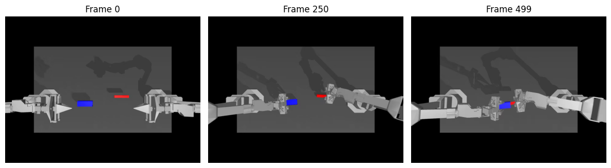
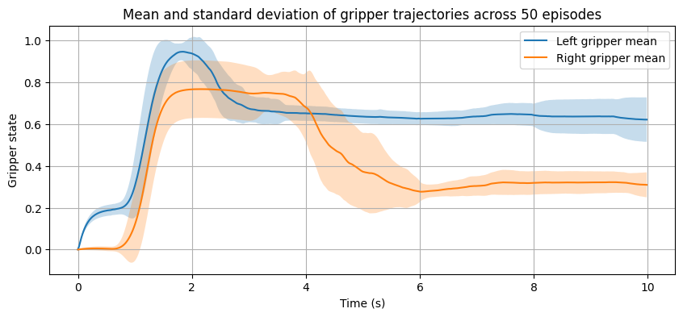
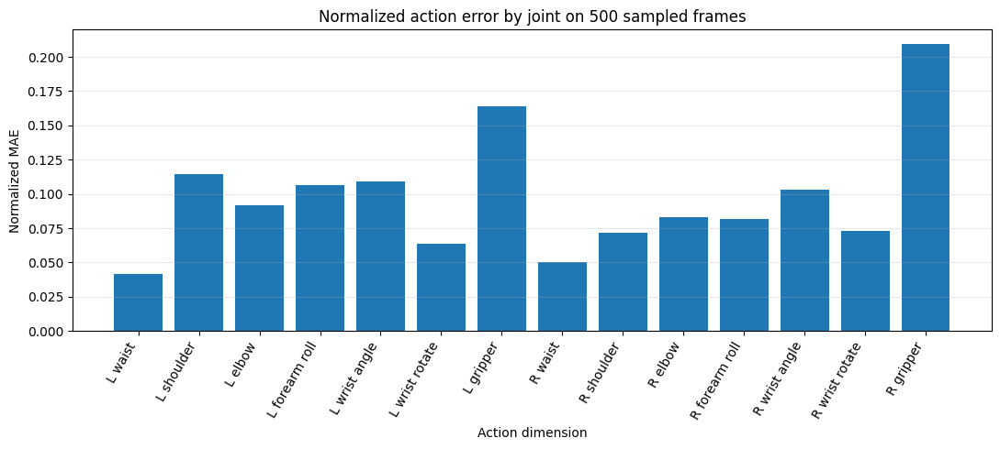
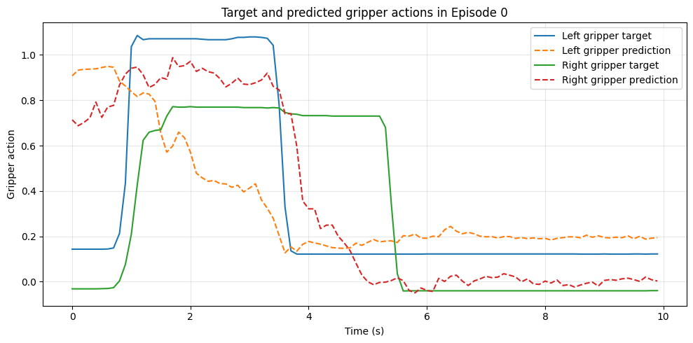

# LeRobot Packaging Automation

LeRobot 공개 조작 데이터셋을 활용해 **ACT(Action Chunking with Transformers)** 정책의 학습·추론 파이프라인을 검증하고, 실제 물류 포장 공정으로 확장하기 위한 **5단계 오케스트레이션 구조**를 설계한 프로젝트입니다.

[](https://colab.research.google.com/github/yelin0342-a11y/lerobot-packaging-automation/blob/main/notebooks/lerobot_packaging_automation.ipynb)

## 1. Project Overview

포장 자동화 공정을 다음 다섯 개의 독립 스킬로 구분했습니다.

```text
Idle → Perception → Pick → Wrapping → Box Insert → Box Push → Complete
```

각 스킬은 `SUCCESS`, `RETRY`, `ABORT` 상태를 반환하며, 실패 시 Recovery를 거쳐 현재 스킬을 재실행하거나 작업을 중단하도록 설계했습니다.

본 프로젝트에서는 공개 데이터와 작업 특성이 가장 유사한 **Box Insert** 단계를 중심으로 Action Policy를 실험했습니다.

## 2. Dataset

사용 데이터셋은 Hugging Face Hub의 [`lerobot/aloha_sim_insertion_human`](https://huggingface.co/datasets/lerobot/aloha_sim_insertion_human)입니다.

| Item | Value |
|---|---|
| Demonstration type | Human demonstrations |
| Robot | Bimanual ALOHA |
| Episodes | 50 |
| Frames | 25,000 |
| Frames per episode | 500 |
| Duration per episode | About 10 seconds |
| Frequency | 50 FPS |
| RGB observation | `(3, 480, 640)` |
| State dimension | 14 |
| Action dimension | 14 |

각 팔은 6개 관절과 1개 gripper 값으로 구성됩니다. 데이터는 접근, 파지, 이동, 정렬, 삽입이 이어지는 양팔 조작 시퀀스를 포함합니다.

## 3. Why ACT?

ACT를 선택한 이유는 다음과 같습니다.

- 파지·이동·정렬·삽입이 시간적으로 연속된 장기 시퀀스입니다.
- 좌우 팔의 협응과 gripper 전환 시점을 함께 다뤄야 합니다.
- ACT는 여러 시점의 행동을 action chunk 단위로 예측합니다.
- ALOHA 기반 양팔 조작 데이터와 구조적으로 잘 맞습니다.

Diffusion Policy는 복잡하고 다중적인 행동 분포 표현에 강점이 있지만, 본 데이터는 전체 작업 순서가 비교적 일관적이므로 시간적 연속성과 장기 행동 구조를 우선했습니다.

## 4. Environment

- Google Colab
- Python 3.12.13
- PyTorch 2.11.0+cu128
- LeRobot 0.6.0
- NVIDIA Tesla T4 14.56 GB

> Colab에서 제공되는 PyTorch/CUDA 환경을 사용하며, LeRobot만 `0.6.0`으로 고정합니다.

## 5. Training Configuration

| Item | Value |
|---|---:|
| Policy | ACT |
| Training steps | 300 |
| Batch size | 8 |
| Learning rate | `1e-5` |
| Trainable parameters | 51,613,582 |
| Training data | All 50 episodes |
| Checkpoint | Step 300 |

학습은 전체 성능을 확보하기 위한 장기 학습이 아니라 데이터 입력, loss 계산, 역전파, 체크포인트 저장·복원 및 inference 경로를 확인하기 위한 제한 실험입니다. 300 steps는 전체 데이터 기준 약 0.1 epoch입니다.

### Training command

```bash
lerobot-train \
  --dataset.repo_id=lerobot/aloha_sim_insertion_human \
  --policy.type=act \
  --output_dir=outputs/act_insertion_300steps \
  --job_name=act_insertion_300steps \
  --policy.device=cuda \
  --policy.push_to_hub=false \
  --batch_size=8 \
  --steps=300 \
  --log_freq=10 \
  --save_freq=300 \
  --wandb.enable=false
```

초기 실행에서는 Hugging Face Hub 업로드 설정으로 인해 다음 오류가 발생했습니다.

```text
ValueError: 'repo_id' argument missing.
Please specify it to push the model to the hub.
```

외부 Hub 업로드가 목적이 아니므로 `--policy.push_to_hub=false`를 추가해 해결했습니다.

## 6. Results

300-step 학습에서 training loss는 **40.333에서 3.141**까지 감소했습니다. 저장한 체크포인트를 다시 불러와 `(1, 14)` 형태의 action을 정상적으로 생성했습니다.

전체 50개 에피소드에서 에피소드별 10개 프레임을 균등 추출해 총 500개 프레임을 평가했습니다.

| Metric | Result |
|---|---:|
| MAE | 0.1039 |
| RMSE | 0.1851 |
| NMAE | 0.0973 |
| Cosine similarity | 0.9336 |
| Mean Pearson correlation | 0.696 |
| Velocity MAE | 0.0209 |
| Mean inference latency | 16.46 ms |
| Median latency | 12.82 ms |
| P95 latency | 38.83 ms |
| Smoothness ratio | 1.3686 |

예측 action의 전체적인 방향과 패턴은 시연과 유사했지만, 오른쪽 gripper의 NMAE가 약 **0.21**, 왼쪽 gripper가 약 **0.16**으로 상대적으로 높았습니다. 또한 smoothness ratio가 1.3686으로, 예측 궤적의 변화량이 시연보다 약 **36.9%** 컸습니다.

### Representative episode



### Gripper variability across 50 episodes



### Joint-wise NMAE



### Target vs. predicted gripper actions



## 7. Five-Stage Orchestration

| Skill | Success condition | Representative failures | Recovery |
|---|---|---|---|
| Perception | Product, packaging material and box poses are valid | Missing detection, occlusion, unstable pose | Re-perception and viewpoint change |
| Pick | Stable grasp and lift without slip | Empty grasp, slip, drop, collision | Retreat, re-perceive and select another grasp |
| Wrapping | Coverage, folds and fixation meet the criteria | Wrinkle, slip, incomplete wrap, tear | Local correction, restart or material replacement |
| Box Insert | Product reaches the target region and depth | Collision, misalignment, jamming | Stop, retreat 2–5 cm, realign and reinsert slowly |
| Box Push | Box reaches the output zone with valid orientation | No movement, rotation, jamming, overshoot | Change contact point, direction or path |

## 8. Repository Structure

```text
lerobot-packaging-automation/
├── README.md
├── requirements.txt
├── .gitignore
├── notebooks/
│   └── lerobot_packaging_automation.ipynb
├── results/
│   ├── representative_episode_frames.png
│   ├── gripper_variability_50episodes.png
│   ├── joint_nmae.png
│   ├── phase_error.png
│   └── gripper_target_vs_prediction.png
└── report/
    └── README.md
```

## 9. How to Run

1. 저장소를 clone하거나 노트북을 Colab에서 엽니다.
2. Colab 런타임을 GPU로 설정합니다.
3. 노트북 셀을 위에서부터 순서대로 실행합니다.
4. 학습 체크포인트는 다음 경로에 저장됩니다.

```text
outputs/act_insertion_300steps/checkpoints/000300/pretrained_model
```

> 전체 데이터셋과 모델 체크포인트는 저장소에 포함하지 않습니다. 실행 시 Hugging Face Hub에서 데이터셋을 내려받으며, 체크포인트는 로컬에서 생성됩니다.

## 10. Limitations

- 전체 50개 에피소드가 학습에 사용되어 독립 테스트 일반화 성능은 측정하지 않았습니다.
- 평가는 저장된 프레임 기반의 in-sample offline diagnostic입니다.
- 실제 로봇 또는 simulator의 closed-loop 성공률은 측정하지 않았습니다.
- 단일 상단 RGB 영상만 사용하며 depth, force, torque, tactile 정보가 없습니다.
- 실제 포장재의 접힘과 변형을 다루는 Wrapping 데이터가 포함되지 않았습니다.

향후에는 독립 검증 데이터, closed-loop rollout, force/tactile sensing, temporal ensembling 및 action smoothing을 통해 실환경 적용 가능성을 검증할 필요가 있습니다.

## Author

**김예린**  
Department of Artificial Intelligence Engineering, Inha University
